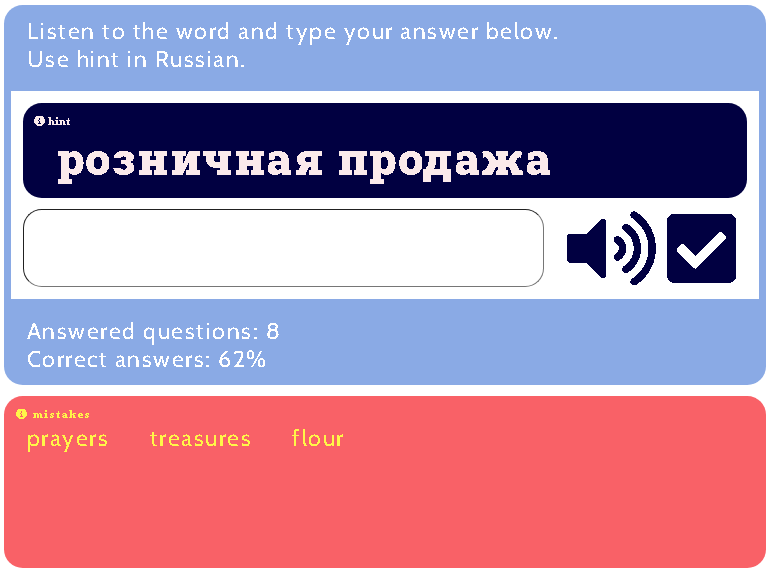
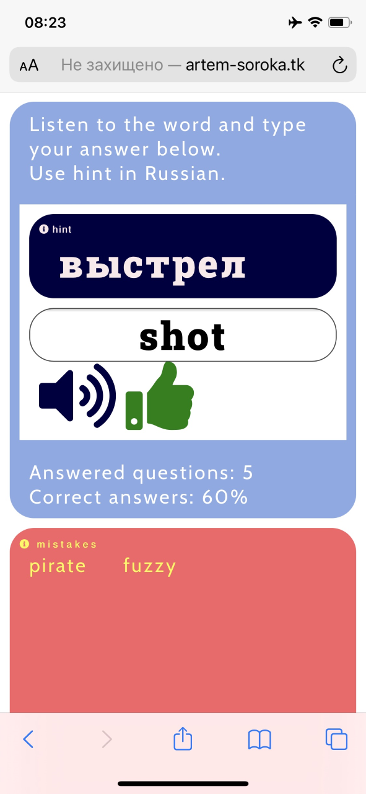

# English spelling test

I wrote this simple test for my family to lear corrct spelling of English words.   
It is based around `SpeechSynthesisUtterance()`, which spells words from collection. The answer is typed into input field. There is also hint in russian above, so can be used to practice words knowledge (just translation without using speech syntesis).     
Collection consists of 17 000 words and phrases.     

Used this cool fonts and styles:
- [FontAwesome](https://fontawesome.com/ "FontAwesome")  
- [Poppins Google font](https://fonts.google.com/specimen/Poppins "Poppins font")         
- [Cabin Google font](https://fonts.google.com/specimen/Cabin "Cabin font")    
- [Roboto Google font](https://fonts.google.com/specimen/Roboto "Roboto font")    

Used soft colors for design with darker color accent  on the question field and control buttons.          
This is example:     
   

     
I created rules to make look better on small screens as well.
      
 
                      

### Test it yourself
Live version can be found [here](http://artem-soroka.tk/pages/eng4/ "English spelling test").      
       
Other versions:      
- [English test for Year 1](http://artem-soroka.tk/pages/eng/ "English test for Year 1")   
- [English test for Year 2](http://artem-soroka.tk/pages/eng2/ "English test for Year 2")   
     
Thank you.